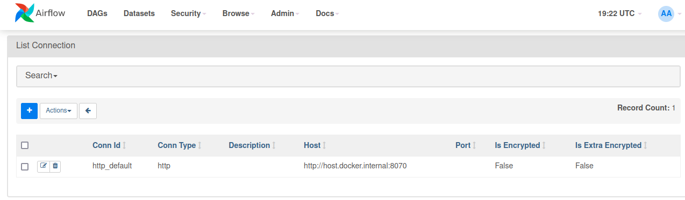

# Fees Workflow API

## Description
This project implements a RESTful API for a fees workflow using Kotlin services to calculate, charge, and record fees for transactions submitted to the public API endpoint. The workflow is orchestrated using Apache Airflow.

## Installation
1. Clone the repository and got to cahsi-ktor.
2. Install dependencies using `./gradlew build`.
3. Run the application using `./gradlew run`.
4. go back to repo and run mkdir ./logs
5. Run docker compose up
6. go to browser and open airflow on http://localhost:8080
7.  To create an HTTP connection:

    Navigate to the Airflow UI.

    Click on the Admin menu and select Connections .

    Click on the + button to create a new connection.

    Set the Conn Id to a unique identifier (e.g., http_default ).

    Choose HTTP as the connection type.

    Enter the base URL for your API or web service in the Host field.

    Provide any additional information required for authentication, such as username, password, or API key.

## Usage
- Endpoint: `/transaction/fee`
- Sample Request:
{
"transaction_id": "txn_001",
"amount": 1000,
"asset": "USD",
"asset_type": "FIAT",
"type": "Mobile Top Up",
"state": "SETTLED - PENDING FEE",
"created_at": "2023-08-30
15:42:17.610059"
}

- Sample Response:
{
"transaction_id": "txn_001",
"amount": 1000,
"asset": "USD",
"type": "Mobile Top Up",
"fee": 1.5,
"rate": 0.0015,
"description": "Standard fee rate of 0.15%",
}

  